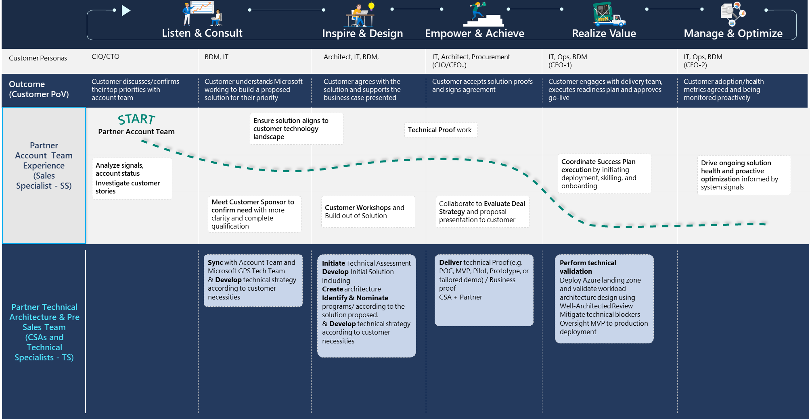
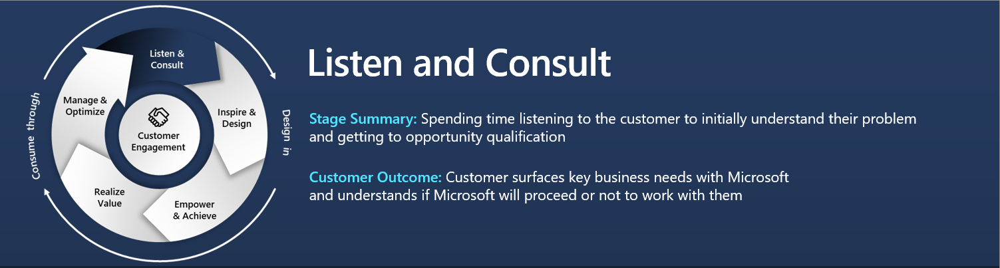
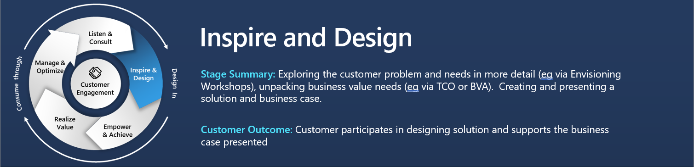
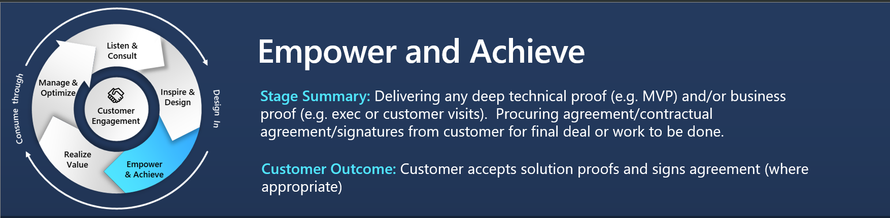
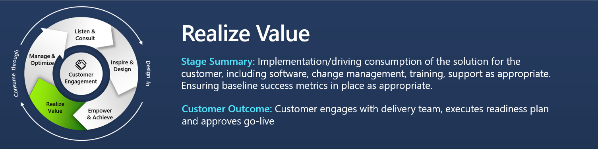
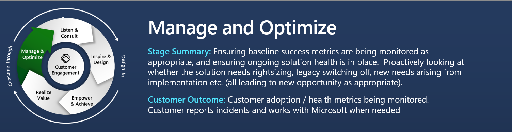

# Project Butterfly

#      
## Opportunity Stages to follow
#  

# 

**Activities:**

- Meet customer to listen and understand, leverage the “Windows Server and SQL Server on Azure pitch deck ” as needed – SS, TS

- Meet with Microsoft Account Team and Microsoft GPS Tech Team to Develop technical strategy according to customer necessities – SS, TS

- Qualify opportunity for Windows server and SQL server migration to Azure – SS

**Exit Criteria:**

- High level definition of Migration Scope and Opportunity/Lead definition and registration on Partner Connect - SS;

**Key Resources:**

- FY23 Data & AI Partner Play book (“Migrate and modernize your data estate” section)- [Link](https://assetsprod.microsoft.com/en-us/fy23-data-and-ai-azure-playbook-1.pdf)

- Windows Server and SQL Server on Azure pitch deck - [Link](https://aka.ms/wandsqlmigratepitch)

- Migrate Windows and SQL Server in a Box – [Link](https://assetsprod.microsoft.com/mpn/en-us/migrate-windows-server-sql-server-pib.pptx)

- Data Driven digital transformation – [Link](https://aka.ms/cdoppt)

- Migrate & Modernize Data Estate Pitch Deck-  [Link](https://aka.ms/datamod)

# 

**Activities:**

- Partner creates inbound deal via partner center with \#DMWL – SS, TS

- Partner review Customer Priorities & Success Criteria based in the discussions with the customer stakeholders. – SS, TS

- Partner initiate a technical assessment or nominate the opportunity to the Solution Assessment Program – SS,TS

- Create and deliver an Architecture Design Session - TS

- Engage GPS Tech team to support in the Technical/Technology architecture, Understand Critical dependencies and  inputs for deep architecture discussions.

**Exit Criteria:**

- Customer reviewed and endorsed the business value - SS

- Technical/Business proof requirements identified -  TS

**Key Resources:**

- Azure SQL Migration Architecture Center: [link](https://learn.microsoft.com/en-us/azure/architecture/guide/migration/migration-start-here) 

- Azure TCO Calculator - [Link](https://azure.microsoft.com/en-us/pricing/tco/)

- Application and Database Modernization Assessment - [Link](https://partner.microsoft.com/en-us/asset/collection/gdpr-solution-assessment)

- Migrate & Modernize Demos - [Link](https://github.com/microsoft/CSAAzureSQLDemo/tree/main/azsql-migration-demos)

# 

**Activities:**

- Incorporate technical patterns/practices (ESLZ, CAF, WAF, WMF) to defined Solution - TS

- Partner confirms solution to GPS Tech Team and nominates to AMMP and to SQL Migration Factory (SMF) – SS

- Define, with key customer decision maker, and deploy a functional small‐scale proof of concepts and evaluate the feasibility of the solution and gain a deeper understanding of the solution needs at full scale using Key Resources described bellow and with GPS Tech team guidance and support– TS

- Present results of PoC to customer key stakeholders – SS, TS.

- Gain customer go ahead for proposal – SS

- Create Proposal incorporating AMMP and SMF strategies as a “OneTeam“ with GPS and STU Microsoft teams – SS, TS

**Exit Criteria:**

- High level definition of Migration Scope and Opportunity/Lead definition and registration on Partner Connect - SS;

- Change opportunity status to “Committed” – SS

- Consumption plan with milestones to track progress during project execution – SS, TS

**Key Resources:**

- Migrate (PoC)- Migrate SQL Server to SQL Server on Azure Virtual Machine online using Azure Data Studio- [Link](https://learn.microsoft.com/azure/dms/tutorial-sql-server-to-virtual-machine-online-ads)

- CAF Migration Process - [Link](https://learn.microsoft.com/en-us/azure/cloud-adoption-framework/migrate/)

- Azure SQL Managed Instance Demo - [Link](https://github.com/microsoft/bobsql/tree/master/demos/sqlmidemo)

- MCW-Migrating-SQL-databases – [Link](https://github.com/microsoft/MCW-Migrating-SQL-databases-to-Azure/blob/master/Hands-on%20lab/HOL%20step-by-step%20-%20Migrating%20SQL%20databases%20to%20Azure.md)

- Azure SQL Workshop - [Link](https://github.com/microsoft/sqlworkshops-azuresqlworkshop)

# 

**Activities:**

- Partner coordinate the Customer Success Plan execution, defining the kick-off date, consumption, user training, set up a rhythm of the business cadence with the customer for the implementation, and initiate support.  SS, TS

- Perform a technical validation: If needed engage GPS Tech Team and any other Microsoft team to validate the technical solution. - TS

- Develop / Implement recommended practices for operations,  governance, and adoption & organizational change/transformation. \#AzureLandingZone - TS

- Mitigate of any technical blockers that may affect solution implementation - TS

**Exit Criteria:**

- Customer reviewed and endorsed the business value - SS

**Key Resources:**

- Azure SQL Architecture Review - [Link](https://learn.microsoft.com/en-us/azure/architecture/framework/services/data/azure-sql-database-well-architected-framework)  
  Azure Well-Architected Framework Review – Assessment : [Link](https://learn.microsoft.com/en-us/assessments/azure-architecture-review/)

- Azure Landing Zone User Guide - [Link](https://github.com/Azure/Enterprise-Scale/wiki/Deploying-Enterprise-Scale-Pre-requisites)

# 

**Activities:**

- Drive customer business value achievement and Monitor usage trends and refresh Consumption Plans appropriately - SS

- Analyze digital signals to maintain and optimize customer success (retention) and Proactive backlog review and action new success plans - TS

**Exit Criteria:**

- Final customer acceptance of project delivery

**Key Resources**

- Cloud Adoption Framework Manage – [Link](https://learn.microsoft.com/en-us/azure/cloud-adoption-framework/manage/)

- Well Architected Deep-dive - [Link](https://learn.microsoft.com/en-us/training/paths/azure-well-architected-framework/)

#
## End of content
# 

## Contributing

This project welcomes contributions and suggestions.  Most contributions require you to agree to a
Contributor License Agreement (CLA) declaring that you have the right to, and actually do, grant us
the rights to use your contribution. For details, visit https://cla.opensource.microsoft.com.

When you submit a pull request, a CLA bot will automatically determine whether you need to provide
a CLA and decorate the PR appropriately (e.g., status check, comment). Simply follow the instructions
provided by the bot. You will only need to do this once across all repos using our CLA.

This project has adopted the [Microsoft Open Source Code of Conduct](https://opensource.microsoft.com/codeofconduct/).
For more information see the [Code of Conduct FAQ](https://opensource.microsoft.com/codeofconduct/faq/) or
contact [opencode@microsoft.com](mailto:opencode@microsoft.com) with any additional questions or comments.

## Trademarks

This project may contain trademarks or logos for projects, products, or services. Authorized use of Microsoft 
trademarks or logos is subject to and must follow 
[Microsoft's Trademark & Brand Guidelines](https://www.microsoft.com/en-us/legal/intellectualproperty/trademarks/usage/general).
Use of Microsoft trademarks or logos in modified versions of this project must not cause confusion or imply Microsoft sponsorship.
Any use of third-party trademarks or logos are subject to those third-party's policies.

